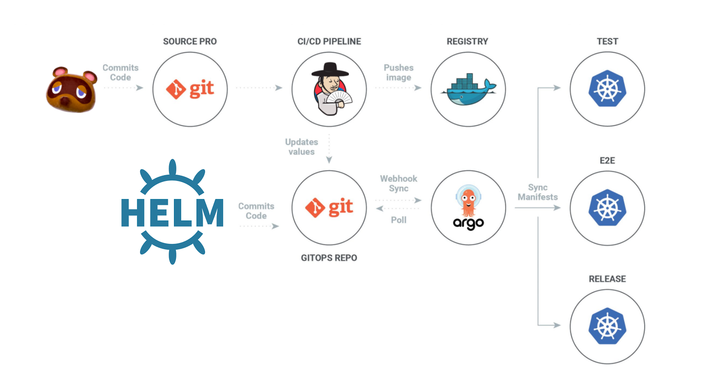

# GitOps-CI/CD Kubernetes and Monitoring
---
### Overview
소스코드를 Gihub Repository에 Commit,Push 하면 Webhook에 의해 Jenkins 빌드가 시작됩니다. Jenkins에서 빌드과정을 거친 후 도커 이미지를 만들어 AWS ECR로 Push 합니다. 관리자가 helm 설정파일을 수정한 후 GITOPS Repository로 Push하면 ArgoCD에서 OutOfSync로 변경 App Sync를 수행하고 AWS EKS에서 변경된 서비스와 Deployment 배포를 시작하고 이미지는 AWS ECR에 있는 이미지를 사용합니다.
* [Kubernetes Config Repo](https://github.com/changhyuni/kubernetes-manifest)
* [Jenkinsfile Repo](https://github.com/changhyuni/jenkins-ecr)
* [Application Repo](https://github.com/changhyuni/django-file-server)

### Architecture

